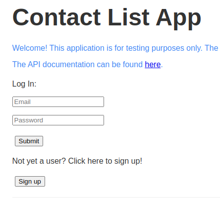
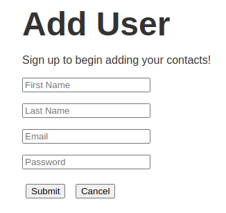
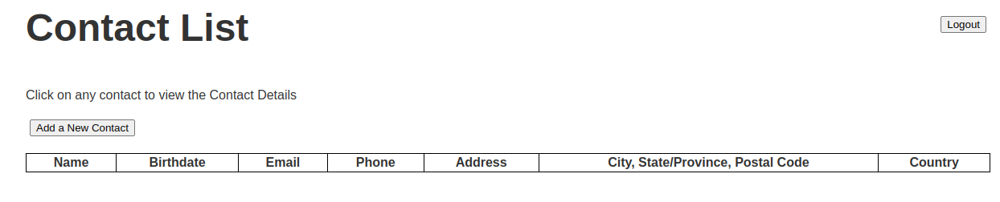

# API & UI Testing Example with Restassured, Selenium and TestNG
This repo demonstrates how to do Test Automation using Java, TestNg & Maven.
- For the API Test Automation we use Restassured
- For the UI Test Automation we use Selenium

**Table of Contents**
<!--ts-->
* [Application under Test](#application-under-test)
* [Example Scenario to Automate](#example-scenario-to-automate)
  * [Login Page](#login-page)
  * [Add User Page](#add-user-page)
  * [Contact List](#contact-list)
* [Exactly what APIs are we testing?](#exactly-what-apis-are-we-testing)
  * [Add User](#add-user)
  * [Login User](#login-user)
  * [Logout User](#logout-user)
  * [Delete User](#delete-user)
* [Repository Structure](#repository-structure)
* [Run the tests](#run-the-tests)
  * [Run the API Tests](#run-the-api-tests)
  * [Run the UI Tests](#run-the-ui-tests)
* [Resources](#resources)
  * [API Tutorials](#api-tutorials)
  * [UI Tutorials](#ui-tutorials)

<!-- Created by https://github.com/ekalinin/github-markdown-toc -->
<!-- Added by: rashad, at: Sun Feb 18 03:37:02 PM EST 2024 -->

<!--te-->

## Application under Test

We will be testing the [Thinking Tester Contact List App](https://thinking-tester-contact-list.herokuapp.com/) (CLA). The CLA enables a user to create an account to manage contacts.

The CLA API Documentation can be found [here](https://documenter.getpostman.com/view/4012288/TzK2bEa8).

## Example Scenario to Automate
Our test covers the specific workflow of opening the login page, creating a new user and logging out.

### Login Page


### Add User Page


### Contact List


## Exactly what APIs are we testing?

In case Thinking App goes down or the API is updated, here is the gist of the current APIs tested at the time of writing.

### Add User

```
POST Request ->
https://thinking-tester-contact-list.herokuapp.com/users

Request Body ->
{
    "firstName": "Test",
    "lastName": "User",
    "email": "test@fake.com",
    "password": "myPassword"
}

Response Status ->
201
```

### Login User

```
POST Request ->
https://thinking-tester-contact-list.herokuapp.com/users/login

Request Body ->
{
    "email": "test2@fake.com",
    "password": "myNewPassword"
}

Response Status ->
200

Response Body ->
{
  "token": "eyJhbGciOiJIUzI1NiIsInR5cCI6IkpXVCJ9.eyJfaWQiOiI2MDgyMWYzMDYyZmJiMjEzZTJhZDlhMjAiLCJpYXQiOjE2MTk3M
}
```

### Logout User

```
POST Request ->
https://thinking-tester-contact-list.herokuapp.com/users/logout

Header ->
Authorization: Bearer $token

Response Status ->
200
```

### Delete User

```
DELETE Request ->
https://thinking-tester-contact-list.herokuapp.com/users/me

Header ->
Authorization: Bearer $token

Response Status ->
200
```

## Repository Structure
```
src/test/java/ThinkTester/ContactListApp
├── Apis
│   └── UserApi.java #Contains the User API Endpoints & Request Specifications
├── Pages #Page objects for the UI
│   ├── AddUserPage.java
│   ├── BasePage.java
│   ├── ContactListPage.java
│   └── LoginPage.java
├── Tests
│   ├── ApiTests #Tests each API
│   │   └── UserApiTest.java
│   └── UiTests #Test cases for the UI
│       └── SmokeUiTest.java
└── Utils
    ├── Environment.java #Specifies the Base URI
    └── UserFactory.java #Creates data for a Random User
```

## Run the tests

### Run the API Tests
```
mvn clean verify -Dtest=*ApiTest
```

### Run the UI Tests
```
mvn clean verify -Dtest=*UiTest
```

## Resources

### API Tutorials
- [Youtube Video Demo API](https://www.youtube.com/watch?v=3ZI9fF9IeP8)
- [Medium Blog Tutorial API](https://medium.com/@RoboticAutomata/restassured-testng-api-test-automation-tutorial-68be216e4d63)

### UI Tutorials
- [Youtube Video Demo UI](https://youtu.be/14JRzMRI5yE)
- [Medium Blog Tutorial UI](https://medium.com/@RoboticAutomata/selenium-testng-ui-test-automation-tutorial-de7ef8bda5af)

